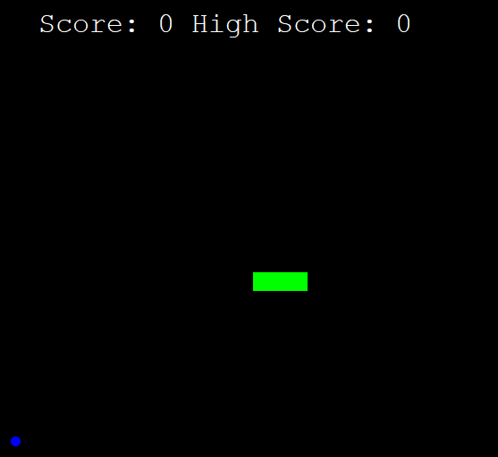

# Snake in Python

## Table of Contents
1. [URL](#url)
2. [Description](#description)
3. [Installation](#installation)
4. [Usage](#usage)
5. [Credits](#credits)

## URL 

Due to the nature of this project, the code has not been deployed. However, the repository can be found at https://github.com/Spacepineapple/python-snake

## Description 

This is a fully playable game of Snake built in Python using the Turtle graphics package. Using the W, A, S and D keys, a player can control the snake and must gather the food without allowing the snake to touch any part of itself or the edges of the window. The player's highest score is tracked using a text file and displayed at the top of the game window. An example screen can be seen below:

## Installation 

To install the game, simply download the repository and unzip the files. Please note that the game requires installation of Python.

## Usage 

To play the game, first download the files from the repository and unzip them. Navigate to the repository and run main.py. Following this, the game window should load and the player will be able to see the snake in green and the food in blue. Using the W, A, S and D keys, move the snake around the screen and collect the food being careful to avoid the edges of the window and the snake's increasingly long tail.

## Credits 

This project was built by myself. The project idea and code was based on an activity in Dr Angela Yu's 100 Days of Code course on Udemy, which I have modified to build the game.